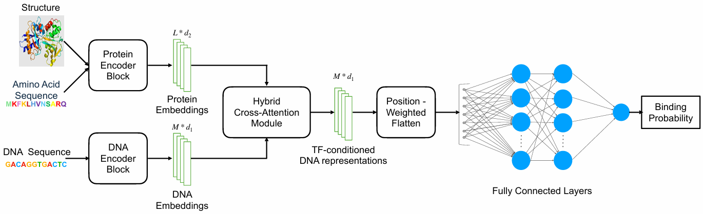
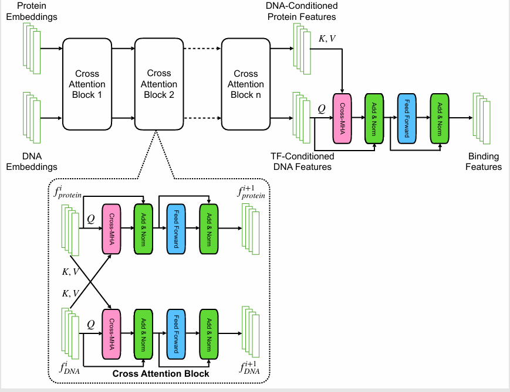

# TFBindFormer

**TFBindFormer** is a hybrid cross-attention Transformer model for
**transcription factor (TF)–DNA binding prediction**. The model
explicitly integrates transcription factor protein representations
derived from **amino-acid sequence** and **protein structural context**
with **genomic DNA sequence bins**, enabling position-specific
modeling of protein–DNA interactions beyond sequence-only approaches.

TFBindFormer is designed for **genome-wide TF binding prediction under
severe class imbalance** and demonstrates improved ranking and
enrichment of bona fide binding sites compared with representative
state-of-the-art models.

---

## Model Architecture

<p align="center">
  
</p>

**Overview of TFBindFormer architecture.**

<p align="center">
  
</p>

**Hybrid cross-attention module illustrating residue–nucleotide interactions.**

---


## Features

- Hybrid cross-attention architecture for explicit residue–nucleotide interactions  
- Integration of TF amino-acid sequence and protein structure information  
- Genome-wide TF binding prediction under extreme class imbalance  
- Modular design for ablation and extension  
- Reproducible training and evaluation pipeline  

---

## Repository Structure

```text
TFBindFormer/
├── data/
│   ├── dna_data/
│   │   ├── train/
│   │   ├── val/
│   │   └── test/
│   └── tf_data/
│       ├── tf_aa_sequence/
│       ├── tf_structure/
│       └── metadata_tfbs.tsv
│
├── scripts/
│   ├── train.py
│   ├── eval.py
│   ├── extract_tf_embeddings.py
│   └── generate_3di_tokens.sh
│
├── src/
│   ├── architectures/
│   │   ├── binding_predictor.py
│   │   ├── cross_attention_encoder.py
│   │   └── tbinet_dna_encoder.py
│   │
│   ├── model.py
│   └── utils.py
│
├── requirements.txt
└── README.md
```

- **data/**: DNA sequence data, TF protein data, and metadata  
- **scripts/**: Training, evaluation, and preprocessing scripts  
- **src/architectures/**: Core model components and attention modules  
- **src/model.py**: TFBindFormer model wrapper  
- **src/utils.py**: Shared utilities and helper functions

---

## Quick Start

### 1. Create environment and install dependencies

```bash
git clone https://github.com/BioinfoMachineLearning/TFBindFormer.git
cd TFBindFormer
conda env create -f environment.yml
conda activate tfbindformer
pip install -e .
```
### 2. External Dependencies

TFBindFormer uses Foldseek-derived 3Di structural tokens to encode protein structural information. 
The 3Di tokens used in this work are included in the released dataset. Users interested in recomputing 
3Di representations from raw protein structures or applying the method to additional transcription factors may install Foldseek following the official documentation:
https://github.com/steineggerlab/foldseek

Ensure the `foldseek` executable is available in your `$PATH`.


### 3. Download dataset

All DNA sequence data and transcription factor (TF)–related data used in this project are publicly available on Zenodo:

https://zenodo.org/records/18305751

Please download the dataset and place it under the data/ directory of this repository, following the directory structure described above. The provided files include the preprocessed DNA inputs, corresponding labels and metadata, and the TF-related data required to reproduce the training and evaluation experiments.


### 4. Generate 3Di structural tokens 
The 3Di tokens used in this study are included in the released dataset.
To recompute 3Di tokens from protein structure files (e.g., PDB) or to generate 3Di representations for additional transcription factors, the following helper script is provided. Internally, this script runs Foldseek to convert protein structures into sequence-like 3Di tokens.

```bash
chmod +x scripts/generate_3di_tokens.sh
./scripts/generate_3di_tokens.sh <pdb_dir> <output_dir>
```
Example:
```bash
./scripts/generate_3di_tokens.sh \
  data/tf_data/tf_structure \
  data/tf_data/3di_out
```
Here, <pdb_dir> contains the protein structure files for transcription factors, and <output_dir> specifies the directory where the generated 3Di token FASTA files will be written.


### 5. Generate TF protein embeddings
TFBindFormer represents transcription factors using embeddings derived from amino acid sequences and 3Di structural tokens. The TF protein embeddings used in this study are included in the released dataset.

To recompute TF protein embeddings from the provided amino acid sequences and 3Di tokens, or to generate embeddings for additional transcription factors, run:

```bash
nohup python scripts/extract_tf_embeddings.py \
  --aa_dir data/tf_data/tf_aa_sequence \
  --di_fasta data/tf_data/3di_out/pdb_3Di_ss.fasta \
  --out_dir data/tf_data/tf_embeddings \
  > extract_tf_embeddings.log 2>&1 &
```
This command reads TF amino acid sequences from tf_aa_sequence, uses the corresponding 3Di token FASTA file, and writes the resulting protein embeddings to tf_embeddings.


### 6. Train TFBindFormer
The following command trains TFBindFormer on the prepared DNA and transcription factor data:
```bash
nohup python train.py \
  --train_dna_npy ../TFBindFormer/data/dna_data/train/train_oneHot.npy \
  --train_labels_npy ../TFBindFormer/data/dna_data/train/train_labels.npy \
  --train_metadata_tsv ../TFBindFormer/data/tf_data/metadata_tfbs.tsv \
  --val_dna_npy ../TFBindFormer/data/dna_data/val/valid_oneHot.npy \
  --val_labels_npy ../TFBindFormer/data/dna_data/val/valid_labels.npy \
  --val_metadata_tsv /bml/ping/TFBindFormer/data/tf_data/metadata_tfbs.tsv \
  --embedding_dir ../TFBindFormer/data/tf_data/tf_embeddings \
  --epochs 20 \
  --batch_size 1024 \
  --num_workers 6 \
  --lr 1e-4 \
  --neg_fraction 0.015 \
  --wandb_project tfbind-train \
  --run_name tfbind_train \
  --output_dir ./checkpoints/tfbind_train \
  > tfbind_train.log 2>&1 &
```
This command trains the global TF–DNA binding prediction model and writes model checkpoints and logs to the specified output directory.

### 7. Evaluation
The following command evaluates a trained TFBindFormer model on the test dataset using a saved checkpoint:
```bash
nohup python eval.py \
  --test_dna_npy ../TFBindFormer/data/dna_data/test/test_oneHot.npy \
  --test_labels_npy ../TFBindFormer/data/dna_data/test/test_labels.npy \
  --test_metadata_tsv ../TFBindFormer/data/tf_data/metadata_tfbs.tsv \
  --embedding_dir ../TFBindFormer/data/tf_data/tf_embeddings_512 \
  --ckpt_path ../checkpoints/---.ckpt \
  --batch_size 1024 \
  --wandb_project tfbind_eval \
  --run_name tfbind_eval \
  > tfbind_eval.log 2>&1 &
```
This command loads the specified model checkpoint, runs evaluation on the test set, and reports performance metrics. When enabled, results are logged to Weights & Biases.

---
## Citation

If you use TFBindFormer in your work, please cite the associated manuscript:
```bash
@unpublished{TFBindFormer,
  title   = {TFBindFormer: A hybrid cross-attention Transformer for transcription factor--DNA binding prediction},
  author  = {Liu, Ping and others},
  note    = {Manuscript in preparation},
  year    = {2026}
}
```

---

## Contact

For questions or issues related to the code or dataset, please open an
issue in this repository. Additional inquiries may be directed to the
corresponding author:

Ping Liu  
Email: pl5vw@missouri.edu

---

