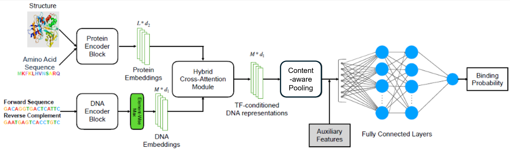
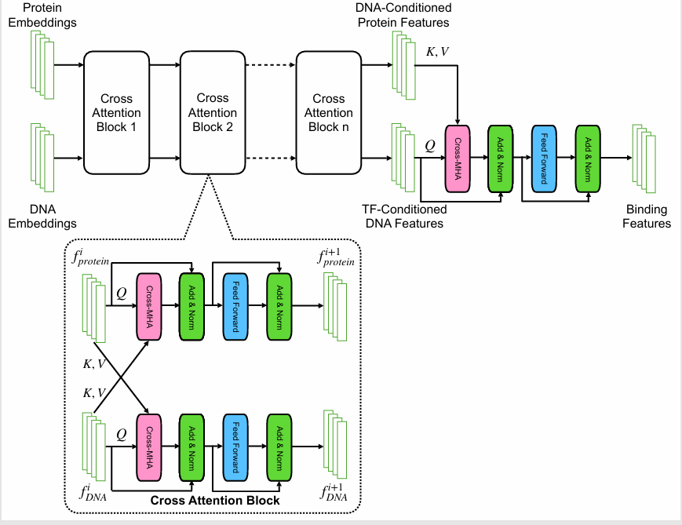

# TFBindFormer

**TFBindFormer** is a hybrid cross-attention Transformer model for
**transcription factor (TF)–DNA binding prediction**. The model
explicitly integrates transcription factor protein representations
derived from **amino-acid sequence** and **protein structural context**
with **genomic DNA sequence bins**, enabling position-specific
modeling of protein–DNA interactions beyond sequence-only approaches.

The revised TFBindFormer framework additionally incorporates
**cell-type embeddings** and supports **zero-shot evaluation on unseen
transcription factors**.

---

## Model Architecture

<p align="center">
  
</p>

**Overview of TFBindFormer architecture.**

<p align="center">
  
</p>

**Hybrid cross-attention module illustrating residue–nucleotide interactions.**

TFBindFormer contains the following major components:

- A DNA encoder for extracting contextual representations from genomic DNA
- TF protein representations derived from amino-acid sequences and
  structure-derived 3Di information
- A hybrid cross-attention module for modeling interactions between TF
  residues and DNA positions
- Cell-type embeddings for incorporating cell-type-specific information
- Content-aware pooling and a prediction head for TF–DNA binding
  classification

---

## What's New in v1.1.0

TFBindFormer v1.1.0 introduces several major updates to the dataset
construction and model framework.

### 1. Forward and reverse-complement sequences are combined within each sample

In the previous dataset, forward and reverse-complement DNA sequences
were treated as separate samples.

In the revised dataset, both orientations are incorporated within the
same sample for each genomic window. As a result, the total number of
genomic-window samples is approximately half that of the previous dataset.

### 2. Eight transcription factors are held out for zero-shot evaluation

In the original dataset, all 108 TFs were included in the training,
validation, and evaluation sets.

In the revised dataset:

- 100 TFs are used for model training, validation, and seen-TF evaluation
- 8 TFs are completely excluded from training and validation
- The 8 held-out TFs are used only for zero-shot evaluation

This setting allows TFBindFormer to be evaluated on transcription factors
that are never observed during model training.

### 3. Cell-type embeddings are added

Cell-type information is incorporated into TFBindFormer as an additional
input representation, enabling the model to capture cell-type-specific
differences in TF–DNA binding patterns.

---

## Features

- Hybrid cross-attention architecture for explicit TF–DNA interactions
- Integration of TF amino-acid sequence and protein structure information
- Cell-type-aware TF–DNA binding prediction
- Zero-shot evaluation on unseen transcription factors
- Genome-wide TF binding prediction under severe class imbalance
- Reproducible training and evaluation pipeline

---

## Repository Structure

The GitHub repository contains the TFBindFormer source code, model
architectures, evaluation utilities, and documentation. The dataset is
distributed separately through Zenodo.

```text
TFBindFormer/
├── figures/
├── scripts/
│   ├── eval.py
│   ├── extract_tf_embeddings.py
│   ├── generate_3di_tokens.sh
│   ├── per_task_metrics.py
│   ├── reduce_or_pad_tf_embeddings.py
│   └── train.py
├── src/
│   ├── architectures/
│   │   ├── __init__.py
│   │   ├── binding_predictor.py
│   │   ├── cross_attention_encoder.py
│   │   └── tbinet_dna_encoder.py
│   ├── __init__.py
│   ├── model.py
│   └── utils.py
├── README.md
├── environment.yml
└── LICENSE
```

- **scripts/train.py**: Trains TFBindFormer using the revised dataset, cached DNA–TF pairs, fixed TF protein representations, and cell-type embeddings.
- **scripts/eval.py**: Evaluates trained models on both seen-TF and unseen-TF datasets.
- **scripts/extract_tf_embeddings.py**: Generates TF protein embeddings from amino-acid sequences and 3Di structural representations.
- **scripts/reduce_or_pad_tf_embeddings.py**: Converts TF protein embeddings to the fixed-length representation used by TFBindFormer.
- **scripts/generate_3di_tokens.sh**: Generates Foldseek-derived 3Di structural tokens from TF protein structures.
- **scripts/per_task_metrics.py**: Computes task-level evaluation metrics from saved predictions.
- **src/architectures/**: Core TFBindFormer neural-network components and cross-attention modules.
- **src/model.py**: PyTorch Lightning model wrapper for TFBindFormer.
- **src/utils.py**: Dataset loading, cached-pair handling, and DataModule utilities.
- **figures/**: Model architecture and framework figures.
- **environment.yml**: Conda environment and software dependencies.

---

## Dataset

The TFBindFormer v1.1.0 dataset contains the data required for model
training, validation, seen-TF testing, and unseen-TF zero-shot evaluation.

The revised dataset includes:

- Genomic DNA sequence data
- Forward sequence representations within each sample
- TF–DNA binding labels
- TF amino-acid sequence data
- TF protein structural information
- Structure-derived 3Di representations
- Precomputed TF embeddings
- Cell-type identifiers
- Metadata describing TF/cell-type prediction tasks
- Seen-TF and unseen-TF dataset partitions

The dataset archive is:

```text
TFBindFormer_dataset_v1.1.0.tar
```

The dataset is available through Zenodo:

```text
DOI: 10.5281/zenodo.23050978
```

URL:

https://doi.org/10.5281/zenodo.23050978

---

## Dataset Splits

### Seen TFs

The seen-TF dataset contains:

- **100 transcription factors**
- **422 TF/cell-type prediction tasks**

The genomic chromosome split is:

- **Training:** all chromosomes except chr4, chr7, chr8, chr9, and chrY
- **Validation:** chr4 and chr7
- **Test:** chr8 and chr9

### Unseen TFs

The zero-shot evaluation dataset contains:

- **8 unseen transcription factors**
- **35 TF/cell-type prediction tasks**

These TFs are completely excluded from model training and validation
and are used only for zero-shot evaluation.

---

## Negative Sampling

All positive DNA–TF pairs are retained.

Negative pairs are sampled using predefined sampling fractions:

| Dataset | Negative sampling fraction |
| --- | ---: |
| Training | 0.003 |
| Validation | 0.5 |
| Seen-TF test | 1.0 |
| Unseen-TF test | 1.0 |

Pair sampling can be independently generated using the specified random seed.

---

## Quick Start

### 1. Create environment and install dependencies

Clone the repository:

```bash
git clone https://github.com/BioinfoMachineLearning/TFBindFormer.git
cd TFBindFormer
```

Create the Conda environment:

```bash
conda env create -f environment.yml
conda activate tfbindformer
```

---

### 2. External Dependencies

TFBindFormer uses Foldseek-derived 3Di structural tokens to encode protein
structural information.

The 3Di tokens used in this work are included in the released dataset.
Users interested in recomputing 3Di representations from raw protein
structures or applying the method to additional transcription factors
may install Foldseek following the official documentation:

https://github.com/steineggerlab/foldseek

Ensure that the `foldseek` executable is available in your `$PATH`.

---

### 3. Download Dataset

All DNA sequence data and TF-related data used by TFBindFormer v1.1.0
are available on Zenodo.

Dataset archive:

```text
TFBindFormer_dataset_v1.1.0.tar
```

Zenodo record:

```text

https://doi.org/10.5281/zenodo.23050978
```

After downloading the archive, place it under the TFBindFormer repository
directory and extract it:

```bash
pwd
# .../TFBindFormer

tar -xf TFBindFormer_dataset_v1.1.0.tar
```

The provided files include the preprocessed DNA inputs, binding labels,
cell-type identifiers, metadata, and TF-related data required for training
and evaluation.

---

### 4. Generate 3Di Structural Tokens

The 3Di tokens used in this study are already included in the released
dataset.

To recompute 3Di tokens from protein structure files or generate 3Di
representations for additional transcription factors, use:

```bash
pwd
# .../TFBindFormer

chmod +x scripts/generate_3di_tokens.sh

./scripts/generate_3di_tokens.sh \
  <pdb_dir> \
  <output_dir>
```

Arguments:

```text
<pdb_dir>:
Directory containing TF protein structure files in PDB format

<output_dir>:
Directory where generated 3Di token FASTA files will be saved
```

Example:

```bash
./scripts/generate_3di_tokens.sh \
  data/tf_data/tf_structure \
  data/tf_data/3di_out
```

---

### 5. Generate TF Protein Embeddings

TFBindFormer represents transcription factors using embeddings derived
from amino-acid sequences and 3Di structural tokens.

The TF protein embeddings used in this study are included in the released
dataset.

To recompute TF protein embeddings from the provided amino-acid sequences
and 3Di tokens, run:

```bash
pwd
# .../TFBindFormer

nohup python scripts/extract_tf_embeddings.py \
  --aa_dir data/tf_data/tf_sequence \
  --di_fasta data/tf_data/3di_out/pdb_3Di_ss.fasta \
  --out_dir data/tf_data/tf_embeddings \
  > extract_tf_embeddings.log 2>&1 &
```

This command loads TF amino-acid sequences and the corresponding
structure-derived 3Di token sequences and generates TF protein embeddings.

---

### 6. Reduce or Pad TF Protein Embeddings to a Fixed Length of 200

The TF protein embeddings generated in the previous step may have different
sequence lengths. TFBindFormer uses a fixed protein representation length of
**200 tokens** for model training and evaluation.

The embeddings are therefore reduced or padded to a fixed length of 200 using
`reduce_or_pad_tf_embeddings.py`.

#### Seen TFs

```bash
pwd
# .../TFBindFormer/scripts

python reduce_or_pad_tf_embeddings.py \
  --metadata_tsv ../data/metadata/seen_tf_metadata.tsv \
  --embedding_dir ../data/tf_data/prostt5_embeddings \
  --out_dir ../data/tf_data/fixed_length_200/seen_tf \
  --target_len 200 \
  --method avgmax \
  --dtype float16
```

#### Unseen TFs

```bash
pwd
# .../TFBindFormer/scripts

python reduce_or_pad_tf_embeddings.py \
  --metadata_tsv ../data/metadata/unseen_tf_metadata.tsv \
  --embedding_dir ../data/tf_data/prostt5_embeddings \
  --out_dir ../data/tf_data/fixed_length_200/unseen_tf \
  --target_len 200 \
  --method avgmax \
  --dtype float16
```

This preprocessing step:

- Converts variable-length TF embeddings to a fixed length of **200 tokens**
- Uses the `avgmax` reduction strategy for embeddings longer than 200 tokens
- Pads shorter embeddings to the target length
- Saves the corresponding TF masks
- Produces model-ready TF representations separately for seen and unseen TFs

The processed files are stored as:

```text
data/tf_data/fixed_length_200/
├── seen_tf/
│   ├── fixed_tf_embs.pt
│   ├── fixed_tf_masks.pt
│   └── tf_names_in_label_order.tsv
└── unseen_tf/
    ├── fixed_tf_embs.pt
    ├── fixed_tf_masks.pt
    └── tf_names_in_label_order.tsv
```

These fixed-length embeddings and masks are then used directly by
`train.py` and `eval.py`.

## Training

TFBindFormer v1.1.0 supports the revised dataset format and
cell-type embeddings.

Run training from the `scripts/` directory:

```bash
pwd
# .../TFBindFormer/scripts

nohup python train.py \
  --train_dna_npy ../data/dna_data/train/train_oneHot.npy \
  --train_labels_npy ../data/dna_data/train/train_labels.npy \
  --train_metadata_tsv ../data/tf_data/metadata_tfbs.tsv \
  --val_dna_npy ../data/dna_data/val/valid_oneHot.npy \
  --val_labels_npy ../data/dna_data/val/valid_labels.npy \
  --val_metadata_tsv ../data/tf_data/metadata_tfbs.tsv \
  --embedding_dir ../data/tf_data/tf_embeddings \
  --epochs 20 \
  --batch_size 1024 \
  --num_workers 6 \
  --lr 1e-4 \
  --neg_fraction 0.015 \
  --use_cell_type \
  --wandb_project tfbind-train \
  --run_name tfbind_train \
  --output_dir ./checkpoints/tfbind_train \
  > tfbind_train.log 2>&1 &
```

This command trains TFBindFormer using preprocessed genomic DNA inputs,
TF–DNA binding labels, precomputed TF protein embeddings, and cell-type
information.

- DNA sequence inputs are loaded from NumPy arrays
- Binding labels are loaded from the corresponding label matrices
- TF metadata specifies the TF/cell-type prediction tasks
- Precomputed TF protein embeddings are loaded from `--embedding_dir`
- Cell-type embeddings are enabled with `--use_cell_type`
- All positive pairs are retained
- Negative pairs are sampled according to `--neg_fraction`
- Model checkpoints are saved to the specified output directory
- Training metrics can be tracked using Weights & Biases

---

## Evaluation

### Seen-TF Evaluation

The seen-TF test set evaluates TF–DNA binding prediction on held-out
genomic chromosomes for TFs represented during model development.

Run:

```bash
pwd
# .../TFBindFormer/scripts

nohup python eval.py \
  --test_dna_npy ../data/dna_data/test/test_oneHot.npy \
  --test_labels_npy ../data/dna_data/test/test_labels.npy \
  --test_metadata_tsv ../data/tf_data/metadata_tfbs.tsv \
  --embedding_dir ../data/tf_data/tf_embeddings \
  --ckpt_path ../checkpoints/---.ckpt \
  --batch_size 1024 \
  --use_cell_type \
  --wandb_project tfbind_eval \
  --run_name tfbind_seen_eval \
  > tfbind_seen_eval.log 2>&1 &
```

This command loads the specified TFBindFormer checkpoint and evaluates
performance on the held-out seen-TF test set.

---

## Zero-Shot Evaluation

TFBindFormer v1.1.0 includes zero-shot evaluation on 8 transcription
factors that are completely excluded from model training and validation.

The trained model is not fine-tuned on these TFs. Instead, their protein
representations are provided during evaluation, allowing TFBindFormer's
ability to generalize to unseen transcription factors to be assessed.

The unseen-TF dataset can be evaluated using the same evaluation pipeline:

```bash
python eval.py \
  --test_dna_npy <unseen_test_dna.npy> \
  --test_labels_npy <unseen_test_labels.npy> \
  --test_metadata_tsv <unseen_metadata.tsv> \
  --embedding_dir ../data/tf_data/tf_embeddings \
  --ckpt_path ../checkpoints/---.ckpt \
  --batch_size 1024 \
  --use_cell_type
```

Replace the placeholder paths with the corresponding unseen-TF data files
from the released dataset.

---

## Hybrid Cross-Attention Module Configuration (Advanced)

The stacked cross-attention blocks illustrated above are implemented in:

```text
src/architectures/cross_attention_encoder.py
src/architectures/binding_predictor.py
```

The number of cross-attention blocks, as well as their internal
configuration including hidden dimension, number of heads, and dropout,
can be adjusted by modifying the corresponding initialization parameters
and module definitions.

The depth of the hybrid cross-attention module controls how many
cross-attention blocks are stacked sequentially.

Each block models residue–nucleotide interactions through cross-attention
followed by feed-forward transformations.

Advanced users may modify these settings to explore alternative model
capacities or architectures.

---

## Version History

### v1.1.0

- Combined forward and reverse-complement DNA sequences within each
  genomic-window sample
- Held out 8 transcription factors for zero-shot evaluation
- Added cell-type embeddings
- Added zero-shot evaluation on unseen TFs
- Updated the training and evaluation pipeline for the revised dataset

### v1.0.0

Initial public release of TFBindFormer.

---

## Citation

TFBindFormer v1.1.0 contains updates beyond the version described in the
original bioRxiv preprint.

### Original TFBindFormer Manuscript

If you use the TFBindFormer framework, please cite the original manuscript:

```bibtex
@article{liu2026tfbindformer,
  title   = {TFBindFormer: A Cross-Attention Transformer for Transcription Factor-DNA Binding Prediction},
  author  = {Liu, Ping and Wang, Lyuwei and Basnet, Shreya and Cheng, Jianlin},
  journal = {bioRxiv},
  year    = {2026},
  doi     = {10.64898/2026.04.09.717563}
}

---

## Contact

For questions or issues related to the code or dataset, please open an
issue in this repository.

Additional inquiries may be directed to:

Ping Liu  
Email: pl5vw@missouri.edu
